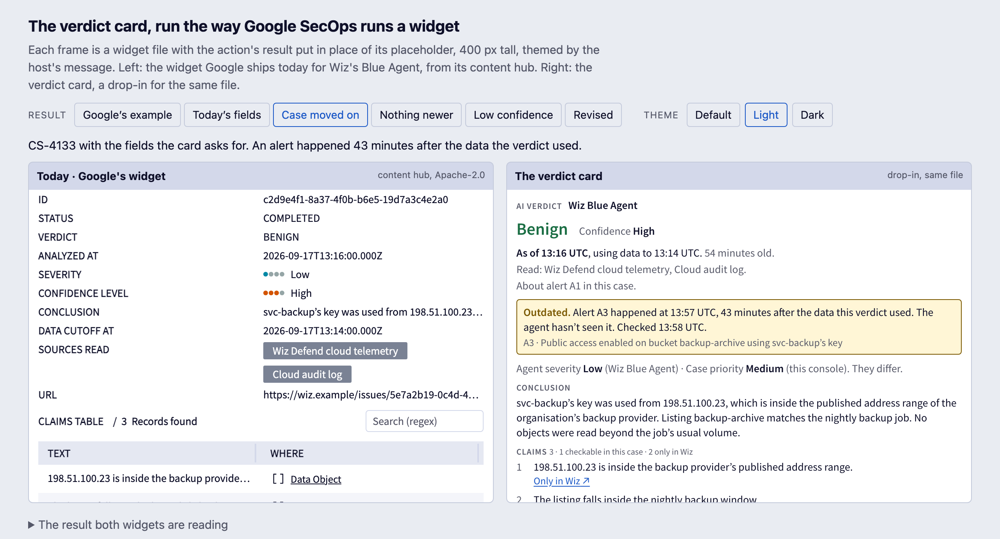

# Verdict card for Wiz's Blue Agent in Google SecOps

A drop-in replacement for the widget Google SecOps ships for Wiz's **Get Blue Agent Analysis** action. It says what the widget in use today doesn't: **how old the verdict is, what the agent looked at, and whether the case has moved on since.**

It's one HTML file and its definition, in the content hub's own format: the same action, placement, size and data binding as the widget it replaces. The case study behind it is at [omkarux.com/verdict-card](https://omkarux.com/verdict-card/).

> Concept work. Not affiliated with Google or Wiz, and not tested with analysts yet. The example cases are invented.



## See it

Open [`dist/harness.html`](dist/harness.html) in a browser. It runs Google's widget and the card side by side, the way the console runs a widget:
- the action's result replaces the placeholder
- each widget sits in a 400 px sandboxed frame
- each takes the host's theme message

Six results and three themes, and every state has its own link: `harness.html?r=cs-4133-moved-on&t=light`.

## What it does with the result as it arrives today

Nothing needs to change in the integration for the first step. From today's seven fields, the card:
- **gives the verdict its age**, counted live: "As of 9 Jun, 16:12 UTC. 109 days old." Today's widget shows `2026-06-09T16:12:58.253716Z`.
- **keeps confidence a word.** Today's widget draws confidence with the same dots as severity.
- **shows the whole conclusion.** Today's widget cuts it to one line, and the rest shows only on hover.
- **says what it can't know yet:** "The agent didn't say what it read, or up to when." and "Can't tell whether the case has moved on: nothing checked it."

## What it asks the result to carry

Every field is optional. The card says more as the result carries more.

| Field | Added by | What the analyst gets |
|---|---|---|
| `aiAnalysis.dataCutoffAt` | the agent | "using data to 13:14 UTC" |
| `aiAnalysis.sourcesRead[]` · `sourcesNotRead[]` | the agent | "Read: Wiz Defend cloud telemetry, Cloud audit log. Not read: Network flow logs." |
| `aiAnalysis.claims[]` · `{ text, where: { kind: alert \| entity \| source, label, url? } }` | the agent | each claim says where to check it: "In this case · alert A2", or "Only in Wiz" |
| `aiAnalysis.missingEvidence` | the agent | at low confidence: "No recommendation.", with the gap in the agent's words |
| `aiAnalysis.revisedFrom` · `{ verdict, analyzedAt, conclusion, reason, decision? }` | the integration, which keeps the verdict it replaces and the analyst's decision | "Revised. It said Benign as of 13:16 UTC; you overrode it to Malicious at 14:04 UTC." plus the earlier conclusion |
| `aiAnalysis.url` | the agent | a link to the analysis, opened in a new tab (https only) |
| `caseContext.coveredAlerts[]` | the action | "About alert A1 in this case." |
| `caseContext.casePriority` | the action | both ratings, each with its owner: "They differ." |
| `caseContext.fetchedAt` | the action | "Added to this case 13:18 UTC" |
| `caseContext.alertsAfterCutoff[]` · `{ id, name, at }`, `caseContext.checkedAt` | whatever checks the case when it changes | "Outdated. Alert A3 happened at 13:57 UTC, 43 minutes after the data this verdict used. The agent hasn't seen it. Checked 13:58 UTC." |

An alert counts as newer when its events came after the cut-off (the clock the cut-off is on), not when it joined the case. Without a check, the card says it can't tell, rather than calling the verdict fresh.

The examples in [`examples/`](examples/) cover each of these, and [`third_party/google-content-hub/`](third_party/google-content-hub/) holds Google's own example result.

## What it doesn't do

It never changes the case. The console's HTML widget displays; it can't write. (The one documented exception, an approval link, only approves or declines a playbook step that is waiting.) So the card has:
- no buttons, forms or inputs
- no requests, and no messages to the host

The only controls are links out. If a console strips its script (Safe HTML rendering), it shows one line saying so, rather than a blank frame.

The decisions (Accept, Override with a reason, Undo) belong to the integration as actions. The admin puts them on a Quick Actions widget, and their record is the Case Wall. Accept is withdrawn while the verdict is outdated or low-confidence: a condition hides a whole widget, so that takes two Quick Actions widgets with complementary conditions.

The cheapest change comes before any widget. The analysis action's output message, which the Case Wall shows, says today "Successfully returned Blue Agent analysis for threat … in Wiz." It could say the verdict and its time instead: "Blue Agent: Benign, confidence High. As of 13:16 UTC, using data to 13:14 UTC." The action can also write that line as an insight (basic HTML, no scripts), so it reaches the Case Wall even where no one installs the widget.

What only a live console can settle, and how the card learns the case has moved on, are on the case study's [build page](https://omkarux.com/verdict-card/build/).

## Use it

- **Integration maintainers:** replace `widgets/get_blue_agent_analysis.html` and `.yaml` in `content/response_integrations/google/wiz/` with [`dist/verdict-card.html`](dist/verdict-card.html) and [`dist/verdict-card.yaml`](dist/verdict-card.yaml). The widget keeps the same action identifier, scope (alert), height (400) and default width (half).
- **Admins:** add it to a playbook's view the way any predefined widget is added.
- **Another agent:** change the two names at the top of the widget's script, the `action_identifier` in its YAML, and the result paths `findAnalysis` reads in `src/card.ts`.

## Build and test

Node 22.13 or later. Nothing to install.

```bash
node --no-warnings build.mjs
node --test tests.mjs
npx -y -p typescript tsc -p .
```

The tests cover:
- reading every result shape Google's widget reads
- the age arithmetic, including the 49 days between the two times on Wiz's launch screenshot
- the outdated rule, where "not checked" and "fresh" are kept apart
- what the agent read and didn't, and which alerts the verdict is about
- low confidence, and revisions that name the analyst's decision
- escaping and https-only links
- that the card draws no control that could change the case

## Licence

Apache-2.0 ([`LICENSE`](LICENSE)). [`third_party/google-content-hub/`](third_party/google-content-hub/) is Google's, unmodified, from [github.com/chronicle/content-hub](https://github.com/chronicle/content-hub) under Apache-2.0. It's here so the harness can compare the two. See [`NOTICE`](NOTICE).

Omkar Khadamkar · [omkarux.com](https://omkarux.com/)
